# KeQuarks — Meta-Model

The KeQuarks meta-model expresses **how the fixed catalogue of relations weaves everything
together**. It is fully **reified**: relations and roles are themselves nodes. This document
presents the model and displays the reference schema.

> Related: [`Requirements_EN.md`](./Requirements_EN.md) (conceptual spec) ·
> [`Conception_Technique_FR.md`](./Conception_Technique_FR.md) §10 (implemented catalogue).

## 1. Reading key

| Colour | Meaning |
|---|---|
| 🟩 green | a **relation** (typed edge — itself a node) |
| 🟨 yellow | a **role** carried by a relation (its two endpoints) |
| 🟦 blue | a **node category** that *emerges* from playing roles |

Nothing is stamped: a blue category is never an attribute stored on a node — it is a **derived
reading** of which roles that node fills across relations.

## 2. The relations (fixed catalogue)

Each relation confers a pair of roles to its two ends:

| Relation | source role | target role | Level |
|---|---|---|---|
| `subsumption` | generalizer | specializer | — |
| `instantiation` | individual | type | — |
| `characterization type` | characterized thing | characterizer | schema |
| `characterization` | characterized thing | characterizer | instance |
| `representation type` | subject | object | schema |
| `representation` | subject | object | instance |

## 3. The two-level duality (schema ↔ instance)

**`instantiation`** is the pivot: it links a **schema-level** relation to its **instance-level**
counterpart, and a **type** node category to its **individual** node category.

- A `characterization type` (e.g. *Person → Name*) is **instantiated** into a
  `characterization` (e.g. *Bernard → "Chabot"*).
- A `representation type` is instantiated into a `representation`.
- Likewise each node category has a **type** side and an **individual** side:
  `node (object type)` ↔ `node (object)`, `node (characteristic type)` ↔
  `node (characteristic)`, `node (topic type)(subject type)` ↔ `node (topic)(subject)`.

**`subsumption`** (generalizer → specializer) relates types to one another (the is-a hierarchy).

## 4. Emergent node categories

Playing a role is what makes a node "be" something:

| A node that fills… | …emerges as |
|---|---|
| `characterized thing` / `subject` | a **topic / subject** |
| `characterizer` | a **characteristic** |
| `object` | an **object** |
| `type` (of an instantiation) | a **type** (topic type, object type, characteristic type…) |
| `individual` (of an instantiation) | an **individual** |

## 5. Schema

```mermaid
flowchart TB
  classDef rel fill:#aef2c0,stroke:#2e7d46,color:#0d2818;
  classDef role fill:#f4f47a,stroke:#b8b800,color:#2a2a00;
  classDef node fill:#7cb6f7,stroke:#1b5fb0,color:#08203f;

  %% --- node categories (blue) ---
  TT["node (topic type)"]:::node
  TST["node (topic type) (subject type)"]:::node
  TS["node (topic) (subject)"]:::node
  OT["node (object type)"]:::node
  OB["node (object)"]:::node
  CT["node (characteristic type)"]:::node
  CH["node (characteristic)"]:::node

  %% --- subsumption ---
  SUB["subsumption"]:::rel
  GEN["generalizer"]:::role
  SPE["specializer"]:::role
  SUB --> GEN --> TT
  SUB --> SPE --> TST

  %% --- instantiation: topic type <-> topic ---
  I1["instantiation"]:::rel
  TY1["type"]:::role
  IN1["individual"]:::role
  I1 --> TY1 --> TST
  I1 --> IN1 --> TS

  %% --- representation type / representation ---
  REPT["representation type"]:::rel
  SUBJ1["subject"]:::role
  OBJ1["object"]:::role
  REPT --> SUBJ1 --> TST
  REPT --> OBJ1 --> OT

  REP["representation"]:::rel
  SUBJ2["subject"]:::role
  OBJ2["object"]:::role
  REP --> SUBJ2 --> TS
  REP --> OBJ2 --> OB

  I2["instantiation"]:::rel
  TY2["type"]:::role
  IN2["individual"]:::role
  I2 --> TY2 --> REPT
  I2 --> IN2 --> REP

  %% --- object type <-> object ---
  I3["instantiation"]:::rel
  TY3["type"]:::role
  IN3["individual"]:::role
  I3 --> TY3 --> OT
  I3 --> IN3 --> OB

  %% --- characterization type / characterization ---
  CART["characterization type"]:::rel
  CTH1["characterized thing"]:::role
  CER1["characterizer"]:::role
  CART --> CTH1 --> TST
  CART --> CER1 --> CT

  CAR["characterization"]:::rel
  CTH2["characterized thing"]:::role
  CER2["characterizer"]:::role
  CAR --> CTH2 --> TS
  CAR --> CER2 --> CH

  I4["instantiation"]:::rel
  TY4["type"]:::role
  IN4["individual"]:::role
  I4 --> TY4 --> CART
  I4 --> IN4 --> CAR

  %% --- characteristic type <-> characteristic ---
  I5["instantiation"]:::rel
  TY5["type"]:::role
  IN5["individual"]:::role
  I5 --> TY5 --> CT
  I5 --> IN5 --> CH
```

## 6. Why it matters

This meta-model is not a taxonomy of boxes but a **relational fabric**: the three content
relations (subsumption, characterization, representation) plus the pivotal `instantiation`
generate — as **natural consequences**, not special cases — the three "killer features":

- **Link Reification** — a relation is a node, so it can be the endpoint of another relation.
- **Multi-Typing** — a node can fill the `individual` role of several `instantiation` edges.
- **Meta-Modeling** — a type is just a node filling a `type` role; the same `instantiation`
  edge re-applies across levels.

Identity (the node) stays put; meaning (its roles and relations) emerges, evolves, and can be
withdrawn — without changing what the node *is*.
